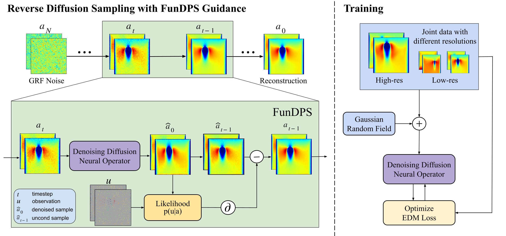
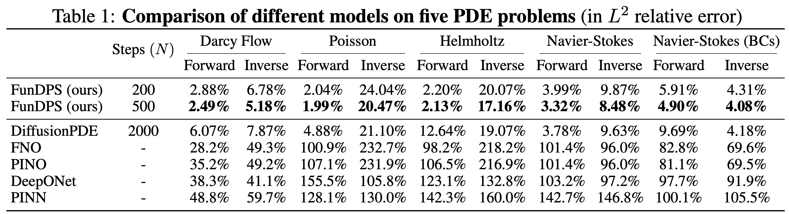

# Guided Diffusion Sampling on Function Spaces with Applications to PDEs

### [FunDPS Paper](https://www.arxiv.org/abs/2505.17004)
Official PyTorch implementation of **Guided Diffusion Sampling on Function Spaces with Applications to PDEs**<br>
Jiachen Yao\*, Abbas Mammadov\*, Julius Berner, Gavin Kerrigan, Jong Chul Ye, Kamyar Azizzadenesheli, Anima Anandkumar<br>
Caltech, NVIDIA, Oxford, KAIST<br>
\*Equal contribution



## Setup
_All experiments were executed on a single NVIDIA RTX 4090._

Clone the repository:
```shell
git clone https://github.com/neuraloperator/FunDPS
cd FunDPS
```

To install the required packages, run:

```shell
conda env create -f environment.yml
conda activate FunDPS
pip install torch==1.12.1+cu113 --extra-index-url https://download.pytorch.org/whl/cu113
```

The following code will download [the datasets from Hugging Face](https://huggingface.co/datasets/jcy20/DiffusionPDE-normalized) for the corresponding experiments and place them in the `data` directory:

```shell
python utils/download_dataset.py darcy # Darcy Flow training set
python utils/download_dataset.py all  # training set
python utils/download_dataset.py all --test  # test set
```

Alternatively you can follow the instructions in [DiffusionPDE](https://github.com/jhhuangchloe/DiffusionPDE) to download the data and place it in the `data` directory. Then process the data by running:

```shell
python utils/dataset_process.py all  # training set
python utils/dataset_process.py all --test  # test set
```

To initialize the wandb environment, run:

```shell
wandb init
```

For generation, download the pre-trained model weights from [here](https://drive.google.com/drive/folders/1mBnSX69f2xwUs9KA37fA_eqbOg0o8AbU?usp=sharing) and update the `.pkl` paths in the corresponding config files under `configs/generation/`.

## Usage

```shell
# Example usage with Darcy Flow dataset
# Train a new diffusion model
python train.py -c=configs/training/darcy.yml --name=darcy

# Forward problem
python generate_pde.py --config configs/generation/darcy_forward.yaml

# Inverse problem
python generate_pde.py --config configs/generation/darcy_inverse.yaml
```

For multi-resolution training, check our paper `Appendix E & G.3`. For multi-resolution inference, check our paper `Appendix G.4` and see configuration file [here](configs/generation/darcy_forward_multi-res.yaml).


## Results


## License

We license our code under the [MIT License](LICENSE.txt).

Our training code is derived from [cond-diffusion-operators-edm](https://github.com/neuraloperator/cond-diffusion-operators-edm) (under MIT License), which is based on [EDM](https://github.com/NVlabs/edm) (under CC BY-NC-SA 4.0).

## Citation
If you find our works interesting, please consider citing

```bibtex
@misc{yao2025guideddiffusionsamplingfunction,
    title={Guided Diffusion Sampling on Function Spaces with Applications to PDEs}, 
    author={Jiachen Yao and Abbas Mammadov and Julius Berner and Gavin Kerrigan and Jong Chul Ye and Kamyar Azizzadenesheli and Anima Anandkumar},
    year={2025},
    eprint={2505.17004},
    archivePrefix={arXiv},
    primaryClass={cs.LG},
    url={https://arxiv.org/abs/2505.17004}, 
}

@article{mammadovdiffusion,
    title={Diffusion-Based Inverse Solver on Function Spaces With Applications to PDEs},
    author={Mammadov, Abbas and Berner, Julius and Azizzadenesheli, Kamyar and Ye, Jong Chul and Anandkumar, Anima},
    journal={Machine Learning and the Physical Sciences Workshop at NeurIPS},
    year={2024},
    url={https://ml4physicalsciences.github.io/2024/files/NeurIPS_ML4PS_2024_253.pdf}
}
```
